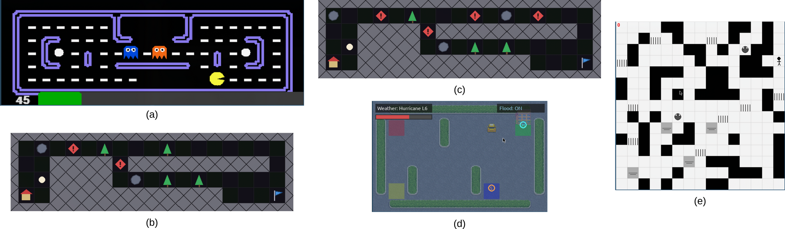

NPC Gym
=======

The **Normative Player Characters Gym** is a framework for implementing and evaluating normative RL agents.

Currently it contains versions of the Gymnasium environments *Pacman* (a), *Merchant* (b, c), *Taxi* (d), and *Gardener* (e).



For each environment multiple norm bases are implemented, each consisting of one or more norms. Norm violations are registered and counted by *norm monitors*.


Prerequisites
-------------

To use the NPC Gym you need to prepare and activate a conda environment as follows:

```
conda env create -n npcgym -f environment.yml
conda activate npcgym
```


Reproducing the Baselines
-------------------------

You can reproduce the baseline experiments from our paper using the scripts `train_merchant.py`, `train_taxi.py`, `train_gardener.py`, and `train_pacman.py`. These scripts also serve as compact examples illustrating how to learn, load, and save models and evaluate them for norm violations (including performing intermediate evaluations during learning).

The following examples are based on `train_merchant.py`. The other scripts can be used analogously.

### Re-Running the Evaluation

```bash
python train_merchant.py
```

This requires existing models in `models/`.

### Rendering the Existing Policies

```bash
RENDER=1 python train_merchant.py
```

This requires existing models in `models/`.

### Re-Training and then Re-Running the Evaluation

```bash
TRAIN=1 python train_merchant.py
```

The models and learning curve data will be saved in `models/`. Old files will be overwritten.

### Notes

* `train_merchant.py` reads the additional environment variable `LAYOUT` which specifies the layout. The default is `LAYOUT=basic`. Additional models are provided for `LAYOUT=dangerous`.


How the NPC Gym Works
---------------------

### Creating Environments

Environments can be generated as follows:

```python
from gymnasium.wrappers import TimeLimit
from norm_rl_gym.envs.taxi import TaxiEnv

env = TaxiEnv(storm_risk=True)
env = TimeLimit(env, max_episode_steps=50)
```

```python
from gymnasium.wrappers import TimeLimit
from norm_rl_gym.envs.merchant.merchant import MerchantEnv

env = MerchantEnv(layout="basic")
env = TimeLimit(env, max_episode_steps=150)
```

```python
from gymnasium.wrappers import TimeLimit
from norm_rl_gym.envs.pacman.pacman_env import PacmanEnv

env = PacmanEnv(layout="smallClassic", features="complete")
env = TimeLimit(env, max_episode_steps=300)
```

```python
from gymnasium.wrappers import TimeLimit
from norm_rl_gym.envs.gardener.gardener import GardenerEnv

env = GardenerEnv(size=15)
env = TimeLimit(env, max_episode_steps=1000)
```

### Evaluating with Monitors

`EvaluationStats` classes are callbacks that use monitors to count norm violations during policy evaluation. They can be used both during learning (for regular intermediate evaluations, e.g. for learning curves) and later for final evaluation.

Minimal abstract setup example:

```python
from utils.stats import MerchantEvaluationStats

evaluation_stats = MerchantEvaluationStats(
    trial=None,
    eval_envs=eval_env,
    train_envs=None,
    n_eval_episodes=100,
    monitor_names=["DangerMonitor", "DeliveryMonitor"],
    int_eval_episodes=0,
    int_eval_frequency=0,
    csv_prefix=None,
)
```

Parameter overview:

- `trial`: optional Optuna trial for logging optimization metadata.
- `eval_envs`: evaluation environment(s) where monitor counts are collected.
- `train_envs`: training env(s), only needed for intermediate evaluations during learning.
- `n_eval_episodes`: number of episodes used for final evaluation/stat normalization.
- `monitor_names`: list of monitor class names to instantiate.
- `int_eval_episodes`: episodes per intermediate evaluation during learning.
- `int_eval_frequency`: training-step frequency for intermediate evaluation during learning.
- `csv_prefix`: optional CSV output prefix (`None` disables CSV writing).

### Learning Policies

For learning, we use models from **Stable-Baselines3** and call their `learn(...)` function.

```python
from stable_baselines3 import DQN

model = DQN("MlpPolicy", train_env, verbose=1, seed=0)
model.learn(total_timesteps=100_000, callback=evaluation_stats)
model.save("models/example_model")
```

### Evaluating Policies

For final evaluation, we use **Stable-Baselines3** `evaluate_policy(...)` together with `EvaluationStats.eval_callback`.

```python
from stable_baselines3.common.evaluation import evaluate_policy

evaluation_stats.init_eval_step(model)
mean_return, std_return = evaluate_policy(
    model,
    eval_env,
    n_eval_episodes=100,
    callback=evaluation_stats.eval_callback,
)
monitor_stats = evaluation_stats.get_stats(100)
```

EvaluationStats Subclasses and Available Monitors
-------------------------------------------------

### Pacman (`PacmanEvaluationStats`)

Available monitors: `VeganMonitor`, `VegetarianBlueMonitor`, `VegetarianOrangeMonitor`, `ConditionalVeganMonitor`, `OblBlueMonitor`, `VeganPreferenceMonitor`, `VeganConflictMonitor`, `CautiousMonitor`, `AllOrNothingMonitor`, `OneTasteMonitor`, `SwitchMonitor`, `PenaltyMonitor`, `Penalty1Monitor`, `Penalty3Monitor`, `TrappedMonitor`, `HungryMonitor`, `HungryVeganMonitor`, `HungryVegetarianMonitor`, `HungryVeganPenaltyMonitor`, `MaximumMonitor`, `ErrandMonitor`, `VisitMonitor`, `SolutionGuiltMaximumMonitor`.

- `VeganPreferenceMonitor` (`VegetarianBlueMonitor`, `VegetarianOrangeMonitor`)
- `VeganConflictMonitor` (`VegetarianBlueMonitor`, `VegetarianOrangeMonitor`, `OblBlueMonitor`)
- `HungryVeganMonitor` (`VegetarianBlueMonitor`, `VegetarianOrangeMonitor`, `HungryMonitor`)
- `HungryVegetarianMonitor` (`VegetarianOrangeMonitor`, `HungryMonitor`)
- `HungryVeganPenaltyMonitor` (`VegetarianBlueMonitor`, `VegetarianOrangeMonitor`, `HungryMonitor`, CTD penalty)
- `MaximumMonitor` (`HungryVeganPenaltyMonitor`, `TrappedMonitor`)
- `SolutionGuiltMaximumMonitor` (`HungryVegetarianMonitor`, `HungryVeganPenaltyMonitor`, `MaximumMonitor`)

### Merchant (`MerchantEvaluationStats`)

Available monitors: `DangerMonitor`, `PacifistMonitor`, `DeliveryMonitor`, `EnvFriendlyMonitor`, `EvolvingMonitor`.

- `PacifistMonitor` (`DangerMonitor`, CTD prohibition after danger)

### Taxi (`TaxiEvaluationStats`)

Available monitors: `EmergencyMonitor`.

### Gardener (`GardenerEvaluationStats`)

Available monitors: `NoCollectMonitor`, `DrainMonitor`, `RescueMonitor`, `CollectOneMonitor`, `CollectPermMonitor`.